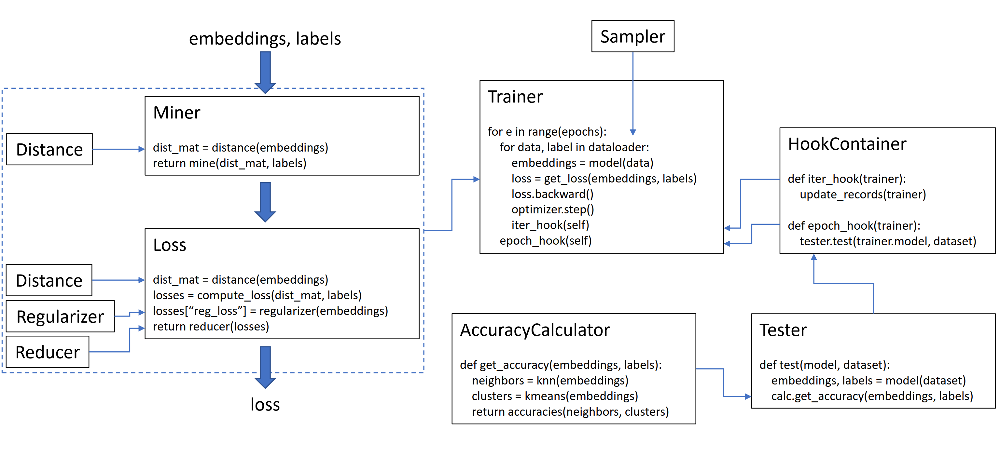
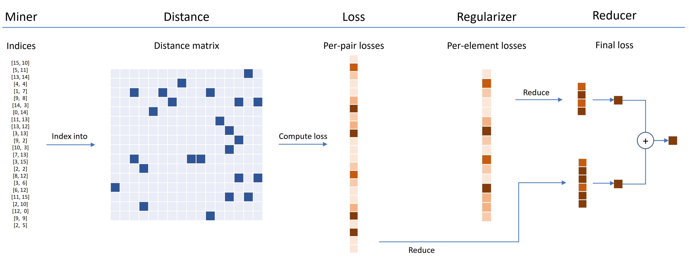

# PyTorch Metric Learning

## Google Colab Examples
See the [examples folder](https://github.com/KevinMusgrave/pytorch-metric-learning/blob/master/examples/README.md) for notebooks you can download or run on Google Colab.

## Overview
This library contains 9 modules, each of which can be used independently within your existing codebase, or combined together for a complete train/test workflow.




## How loss functions work

### Using losses and miners in your training loop
Let’s initialize a plain [TripletMarginLoss](losses/#tripletmarginloss):
```python
from pytorch_metric_learning import losses
loss_func = losses.TripletMarginLoss()
```

To compute the loss in your training loop, pass in the embeddings computed by your model, and the corresponding labels. The embeddings should have size (N, embedding_size), and the labels should have size (N), where N is the batch size.

```python
# your training loop
for i, (data, labels) in enumerate(dataloader):
	optimizer.zero_grad()
	embeddings = model(data)
	loss = loss_func(embeddings, labels)
	loss.backward()
	optimizer.step()
```

The TripletMarginLoss computes all possible triplets within the batch, based on the labels you pass into it. Anchor-positive pairs are formed by embeddings that share the same label, and anchor-negative pairs are formed by embeddings that have different labels. 

Sometimes it can help to add a mining function:
```python
from pytorch_metric_learning import miners, losses
miner = miners.MultiSimilarityMiner()
loss_func = losses.TripletMarginLoss()

# your training loop
for i, (data, labels) in enumerate(dataloader):
	optimizer.zero_grad()
	embeddings = model(data)
	hard_pairs = miner(embeddings, labels)
	loss = loss_func(embeddings, labels, hard_pairs)
	loss.backward()
	optimizer.step()
```
In the above code, the miner finds positive and negative pairs that it thinks are particularly difficult. Note that even though the TripletMarginLoss operates on triplets, it’s still possible to pass in pairs. This is because the library automatically converts pairs to triplets and triplets to pairs, when necessary.

### Customizing loss functions
Loss functions can be customized using [distances](distances.md), [reducers](reducers.md), and [regularizers](regularizers.md).


Here's an example of a customized TripletMarginLoss:
```python
from pytorch_metric_learning.distances import CosineSimilarity
from pytorch_metric_learning.reducers import ThresholdReducer
from pytorch_metric_learning.regularizers import LpRegularizer
from pytorch_metric_learning import losses
loss_func = losses.TripletMarginLoss(distance = CosineSimilarity(), 
									reducer = ThresholdReducer(high=0.3), 
									embedding_regularizer = LpRegularizer())
```
This customized triplet loss has the following properties:

 - The loss will be computed using cosine similarity instead of Euclidean distance.
 - All triplet losses that are higher than 0.3 will be discarded.
 - The embeddings will be L2 regularized.  

### Using loss functions for unsupervised / self-supervised learning

The TripletMarginLoss is an embedding-based or tuple-based loss. This means that internally, there is no real notion of "classes". Tuples (pairs or triplets) are formed at each iteration, based on the labels it receives. The labels don't have to represent classes. They simply need to indicate the positive and negative relationships between the embeddings. Thus, it is easy to use these loss functions for unsupervised or self-supervised learning. 

For example, the code below is a simplified version of the augmentation strategy commonly used in self-supervision. The dataset does not come with any labels. Instead, the labels are created in the training loop, solely to indicate which embeddings are positive pairs.

```python
# your training for-loop
for i, data in enumerate(dataloader):
	optimizer.zero_grad()
	embeddings = your_model(data)
	augmented = your_model(your_augmentation(data))
	labels = torch.arange(embeddings.size(0))

	embeddings = torch.cat([embeddings, augmented], dim=0)
	labels = torch.cat([labels, labels], dim=0)

	loss = loss_func(embeddings, labels)
	loss.backward()
	optimizer.step()
```


## Highlights of the rest of the library

- For a convenient way to train your model, take a look at the [trainers](trainers).
- Want to test your model's accuracy on a dataset? Try the [testers](testers/).
- To compute the accuracy of an embedding space directly, use [AccuracyCalculator](accuracy_calculation.md).

If you're short of time and want a complete train/test workflow, check out the [example Google Colab notebooks](https://github.com/KevinMusgrave/pytorch-metric-learning/tree/master/examples).


## Installation
### Pip
```
pip install pytorch-metric-learning
```

**To get the latest dev version**:
```
pip install pytorch-metric-learning --pre
```

**To install on Windows**:
```
pip install torch===1.4.0 torchvision===0.5.0 -f https://download.pytorch.org/whl/torch_stable.html
pip install pytorch-metric-learning
```

**To install with evaluation and logging capabilities (This will install the unofficial pypi version of faiss-gpu)**:
```
pip install pytorch-metric-learning[with-hooks]
```

**To install with evaluation and logging capabilities (CPU) (This will install the unofficial pypi version of faiss-cpu)**:
```
pip install pytorch-metric-learning[with-hooks-cpu]
```

### Conda
```
conda install pytorch-metric-learning -c metric-learning -c pytorch
```

**To use the testing module, you'll need faiss, which can be installed via conda as well. See the [installation instructions for faiss](https://github.com/facebookresearch/faiss/blob/master/INSTALL.md).**
