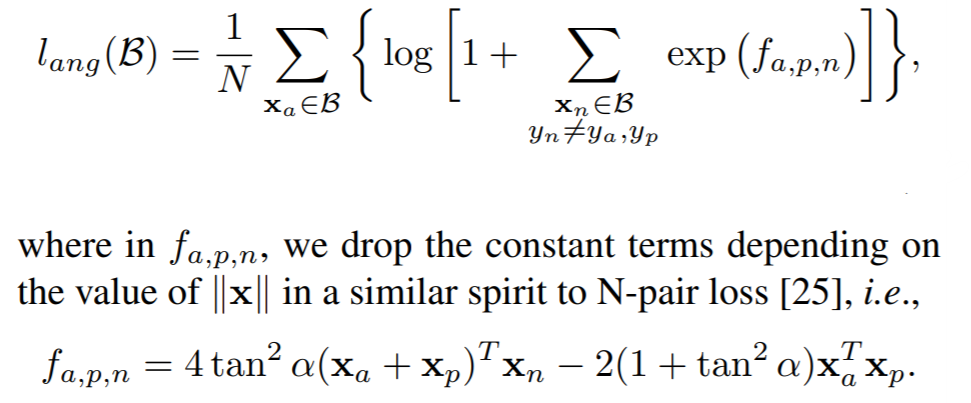
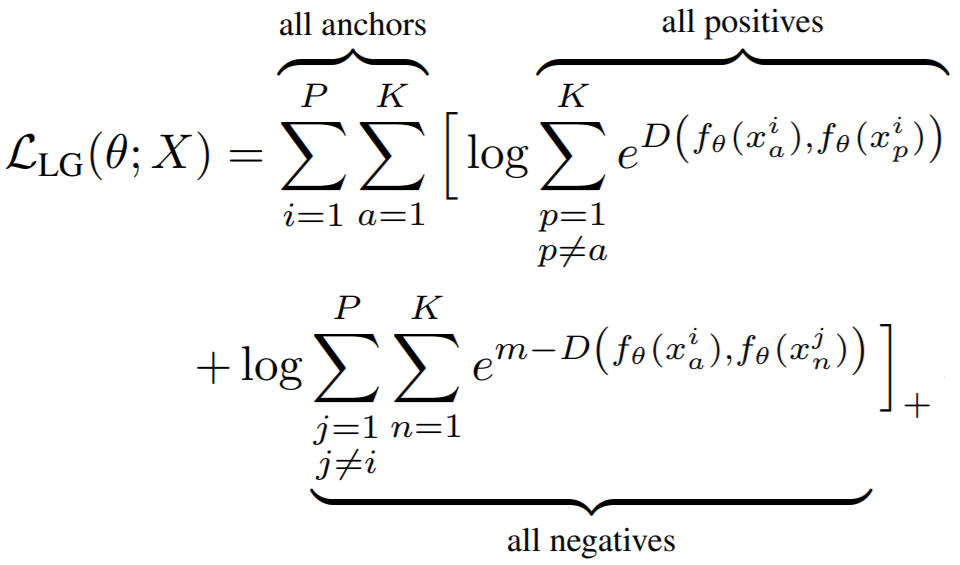
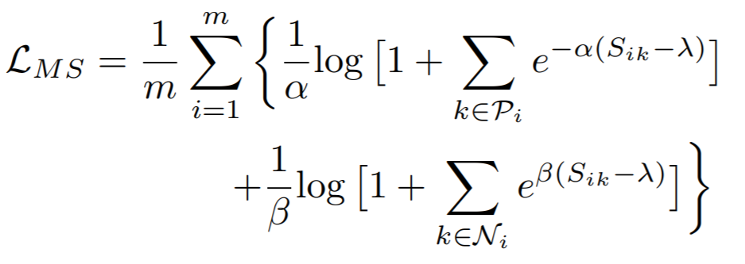
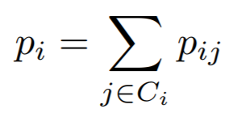

# Losses
All loss functions are used as follows:

```python
from pytorch_metric_learning import losses
loss_func = losses.SomeLoss()
loss = loss_func(embeddings, labels) # in your training for-loop
```

Or if you are using a loss in conjunction with a [miner](miners.md):

```python
from pytorch_metric_learning import miners, losses
miner_func = miners.SomeMiner()
loss_func = losses.SomeLoss()
miner_output = miner_func(embeddings, labels) # in your training for-loop
loss = loss_func(embeddings, labels, miner_output)
```

You can also specify how losses get reduced to a single value by using a [reducer](reducers.md):
```python
from pytorch_metric_learning import losses, reducers
reducer = reducers.SomeReducer()
loss_func = losses.SomeLoss(reducer=reducer)
loss = loss_func(embeddings, labels) # in your training for-loop
```


## AngularLoss 
[Deep Metric Learning with Angular Loss](https://arxiv.org/pdf/1708.01682.pdf){target=_blank}
```python
losses.AngularLoss(alpha=40, **kwargs)
```
**Equation**:

{: style="height:200px"}


**Parameters**:

* **alpha**: The angle specified in degrees. The paper uses values between 36 and 55.

**Default distance**: 

 - [```LpDistance(p=2, power=1, normalize_embeddings=True)```](distances.md#lpdistance)

     - This is the only compatible distance.

**Default reducer**: 

 - [MeanReducer](reducers.md#meanreducer)

**Reducer input**:

* **loss**: The loss for every ```a1```, where ```(a1,p)``` represents every positive pair in the batch. Reduction type is ```"element"```.


## ArcFaceLoss 
[ArcFace: Additive Angular Margin Loss for Deep Face Recognition](https://arxiv.org/pdf/1801.07698.pdf){target=_blank}

```python
losses.ArcFaceLoss(num_classes, embedding_size, margin=28.6, scale=64, **kwargs)
```

**Equation**:

{: style="height:80px"}


**Parameters**:

* **margin**: The angular margin penalty in degrees. In the above equation, ```m = radians(margin)```. The paper uses 0.5 radians, which is 28.6 degrees.
* **num_classes**: The number of classes in your training dataset.
* **embedding_size**: The size of the embeddings that you pass into the loss function. For example, if your batch size is 128 and your network outputs 512 dimensional embeddings, then set ```embedding_size``` to 512.
* **scale**: This is ```s``` in the above equation. The paper uses 64.

**Other info**: 

* This also extends [WeightRegularizerMixin](losses.md#weightregularizermixin), so it accepts ```weight_regularizer```, ```weight_reg_weight```, and ```weight_init_func``` as optional arguments.
* This loss **requires an optimizer**. You need to create an optimizer and pass this loss's parameters to that optimizer. For example:
```python
loss_func = losses.ArcFaceLoss(...).to(torch.device('cuda'))
loss_optimizer = torch.optim.SGD(loss_func.parameters(), lr=0.01)
# then during training:
loss_optimizer.step()
```

**Default distance**: 

 - [```CosineSimilarity()```](distances.md#cosinesimilarity)
     - This is the only compatible distance.

**Default reducer**: 

 - [MeanReducer](reducers.md#meanreducer)

**Reducer input**:

* **loss**: The loss per element in the batch. Reduction type is ```"element"```.


## BaseMetricLossFunction
All loss functions extend this class and therefore inherit its ```__init__``` parameters.

```python
losses.BaseMetricLossFunction(collect_stats = True, 
							reducer = None, 
							distance = None, 
							embedding_regularizer = None,
							embedding_reg_weight = 1)
```

**Parameters**:

* **collect_stats**: If True, will collect various statistics that may be useful to analyze during experiments. If False, these computations will be skipped.
* **reducer**: A [reducer](reducers.md) object. If None, then the default reducer will be used.
* **distance**: A [distance](distances.md) object. If None, then the default distance will be used.
* **embedding_regularizer**: A [regularizer](regularizers.md) object that will be applied to embeddings. If None, then no embedding regularization will be used.
* **embedding_reg_weight**: If an embedding regularizer is used, then its loss will be multiplied by this amount before being added to the total loss.

**Default distance**: 

 - [```LpDistance(normalize_embeddings=True, p=2, power=1)```](distances.md#lpdistance)

**Default reducer**: 

- [MeanReducer](reducers.md#meanreducer)

**Reducer input**:

* **embedding_reg_loss**: Only exists if an embedding regularizer is used. It contains the loss per element in the batch. Reduction type is ```"already_reduced"```. 


**Required Implementations**:
```python
def compute_loss(self, embeddings, labels, indices_tuple=None):
    raise NotImplementedError
```


## CircleLoss 
[Circle Loss: A Unified Perspective of Pair Similarity Optimization](https://arxiv.org/pdf/2002.10857.pdf){target=_blank}

```python
losses.CircleLoss(m=0.4, gamma=80, **kwargs)
```

**Equations**:

{: style="height:150px"}

where

{: style="height:70px"}

{: style="height:25px"}

{: style="height:25px"}

{: style="height:25px"}

{: style="height:25px"}

{: style="height:25px"}

{: style="height:25px"}


**Parameters**:

* **m**: The relaxation factor that controls the radius of the decision boundary. The paper uses 0.25 for face recognition, and 0.4 for fine-grained image retrieval (images of birds, cars, and online products).
* **gamma**: The scale factor that determines the largest scale of each similarity score. The paper uses 256 for face recognition, and 80 for fine-grained image retrieval.

**Default distance**: 

 - [```CosineSimilarity()```](distances.md#cosinesimilarity)

    - This is the only compatible distance.

**Default reducer**: 

 - [AvgNonZeroReducer](reducers.md#avgnonzeroreducer)

**Reducer input**:

* **loss**: The loss per element in the batch. Reduction type is ```"element"```.

## ContrastiveLoss
```python
losses.ContrastiveLoss(pos_margin=0, neg_margin=1, **kwargs):
```

**Equation**:

{: style="height:30px"}

**Parameters**:

* **pos_margin**: The distance (or similarity) over (under) which positive pairs will contribute to the loss.
* **neg_margin**: The distance (or similarity) under (over) which negative pairs will contribute to the loss.  

Note that the default values for ```pos_margin``` and ```neg_margin``` are suitable if you are using a non-inverted distance measure, like [LpDistance](distances.md#lpdistance). If you use an inverted distance measure like [CosineSimilarity](distances.md#cosinesimilarity), then more appropriate values would be ```pos_margin = 1``` and ```neg_margin = 0```.

**Default distance**: 

 - [```LpDistance(normalize_embeddings=True, p=2, power=1)```](distances.md#lpdistance)

**Default reducer**: 

 - [AvgNonZeroReducer](reducers.md#avgnonzeroreducer)

**Reducer input**:

* **pos_loss**: The loss per positive pair in the batch. Reduction type is ```"pos_pair"```.
* **neg_loss**: The loss per negative pair in the batch. Reduction type is ```"neg_pair"```.


## CosFaceLoss 
[CosFace: Large Margin Cosine Loss for Deep Face Recognition](https://arxiv.org/pdf/1801.09414.pdf){target=_blank}

```python
losses.CosFaceLoss(num_classes, embedding_size, margin=0.35, scale=64, **kwargs)
```

**Equation**:

{: style="height:80px"}

**Parameters**:

* **margin**: The cosine margin penalty (m in the above equation). The paper used values between 0.25 and 0.45.
* **num_classes**: The number of classes in your training dataset.
* **embedding_size**: The size of the embeddings that you pass into the loss function. For example, if your batch size is 128 and your network outputs 512 dimensional embeddings, then set ```embedding_size``` to 512.
* **scale**: This is ```s``` in the above equation. The paper uses 64.

**Other info**: 

* This also extends [WeightRegularizerMixin](losses.md#weightregularizermixin), so it accepts ```weight_regularizer```, ```weight_reg_weight```, and ```weight_init_func``` as optional arguments.
* This loss **requires an optimizer**. You need to create an optimizer and pass this loss's parameters to that optimizer. For example:
```python
loss_func = losses.CosFaceLoss(...).to(torch.device('cuda'))
loss_optimizer = torch.optim.SGD(loss_func.parameters(), lr=0.01)
# then during training:
loss_optimizer.step()
```

**Default distance**: 

 - [```CosineSimilarity()```](distances.md#cosinesimilarity)

    - This is the only compatible distance.

**Default reducer**: 

 - [MeanReducer](reducers.md#meanreducer)

**Reducer input**:

* **loss**: The loss per element in the batch. Reduction type is ```"element"```.


## CrossBatchMemory 
This wraps a loss function, and implements [Cross-Batch Memory for Embedding Learning](https://arxiv.org/pdf/1912.06798.pdf){target=_blank}. It stores embeddings from previous iterations in a queue, and uses them to form more pairs/triplets with the current iteration's embeddings.

```python
losses.CrossBatchMemory(loss, embedding_size, memory_size=1024, miner=None)
```

**Parameters**:

* **loss**: The loss function to be wrapped. For example, you could pass in ```ContrastiveLoss()```.
* **embedding_size**: The size of the embeddings that you pass into the loss function. For example, if your batch size is 128 and your network outputs 512 dimensional embeddings, then set ```embedding_size``` to 512.
* **memory_size**: The size of the memory queue.
* **miner**: An optional [tuple miner](miners.md), which will be used to mine pairs/triplets from the memory queue.

**Forward function**
```python
loss_fn(embeddings, labels, indices_tuple=None, enqueue_idx=None)
```

As shown above, CrossBatchMemory comes with a 4th argument in its ```forward``` function:

* **enqueue_idx**: The indices of ```embeddings``` that will be added to the memory queue. In other words, only ```embeddings[enqueue_idx]``` will be added to memory. This enables CrossBatchMemory to be used in self-supervision frameworks like [MoCo](https://arxiv.org/pdf/1911.05722.pdf). Check out the [MoCo on CIFAR100](https://github.com/KevinMusgrave/pytorch-metric-learning/tree/master/examples#simple-examples) notebook to see how this works.

## FastAPLoss
[Deep Metric Learning to Rank](http://openaccess.thecvf.com/content_CVPR_2019/papers/Cakir_Deep_Metric_Learning_to_Rank_CVPR_2019_paper.pdf){target=_blank}

```python
losses.FastAPLoss(num_bins=10, **kwargs)
```

**Parameters**:

* **num_bins**: The number of soft histogram bins for calculating average precision. The paper suggests using 10.

**Default distance**:

- [```LpDistance(normalize_embeddings=True, p=2, power=2)```](distances.md#lpdistance)
    - The only compatible distance is ```LpDistance(normalize_embeddings=True, p=2)```. However, the ```power``` value can be changed.

**Default reducer**: 

 - [MeanReducer](reducers.md#meanreducer)

**Reducer input**:

* **loss**: The loss per element that has at least 1 positive in the batch. Reduction type is ```"element"```.


## GenericPairLoss
```python
losses.GenericPairLoss(mat_based_loss, **kwargs)
```
**Parameters**:

* **mat_based_loss**: See required implementations.

**Required Implementations**:
```python
# If mat_based_loss is True, then this takes in mat, pos_mask, neg_mask
# If False, this takes in pos_pair, neg_pair, indices_tuple
def _compute_loss(self):
    raise NotImplementedError
```

## GeneralizedLiftedStructureLoss
This was presented in [In Defense of the Triplet Loss for Person Re-Identification](https://arxiv.org/pdf/1703.07737.pdf){target=_blank}. It is a modification of the original [LiftedStructureLoss](losses.md#liftedstructureloss)

```python
losses.GeneralizedLiftedStructureLoss(neg_margin=1, pos_margin=0, **kwargs)
```
**Equation**:

{: style="height:250px"}

**Parameters**:

* **pos_margin**: The margin in the expression ```e^(D - margin)```. The paper uses ```pos_margin = 0 ```, which is why this margin does not appear in the above equation.
* **neg_margin**: This is ```m``` in the above equation. The paper used values between 0.1 and 1.

**Default distance**: 

 - [```LpDistance(normalize_embeddings=True, p=2, power=1)```](distances.md#lpdistance)

**Default reducer**: 

 - [MeanReducer](reducers.md#meanreducer)

**Reducer input**:

* **loss**: The loss per element in the batch. Reduction type is ```"element"```.

## IntraPairVarianceLoss
[Deep Metric Learning with Tuplet Margin Loss](http://openaccess.thecvf.com/content_ICCV_2019/papers/Yu_Deep_Metric_Learning_With_Tuplet_Margin_Loss_ICCV_2019_paper.pdf){target=_blank}
```python
losses.IntraPairVarianceLoss(pos_eps=0.01, neg_eps=0.01, **kwargs)
```

**Equations**:

{: style="height:39px"}

{: style="height:34px"}

**Parameters**:

* **pos_eps**: The epsilon in the L<sub>pos</sub> equation. The paper uses 0.01.
* **neg_eps**: The epsilon in the L<sub>neg</sub> equation. The paper uses 0.01.

You should probably use this in conjunction with another loss, as described in the paper. You can accomplish this by using [MultipleLosses](losses.md#multiplelosses):
```python
main_loss = losses.TupletMarginLoss()
var_loss = losses.IntraPairVarianceLoss()
complete_loss = losses.MultipleLosses([main_loss, var_loss], weights=[1, 0.5])
```

**Default distance**: 

 - [```LpDistance(normalize_embeddings=True, p=2, power=1)```](distances.md#lpdistance)

**Default reducer**: 

 - [MeanReducer](reducers.md#meanreducer)

**Reducer input**:

* **pos_loss**: The loss per positive pair in the batch. Reduction type is ```"pos_pair"```.
* **neg_loss**: The loss per negative pair in the batch. Reduction type is ```"neg_pair"```.


## LargeMarginSoftmaxLoss
[Large-Margin Softmax Loss for Convolutional Neural Networks](https://arxiv.org/pdf/1612.02295.pdf){target=_blank}

```python
losses.LargeMarginSoftmaxLoss(num_classes, 
                            embedding_size, 
                            margin=4, 
                            scale=1, 
                            **kwargs)
```

**Equations**:

{: style="height:80px"}

where

{: style="height:90px"}

**Parameters**:

* **num_classes**: The number of classes in your training dataset.
* **embedding_size**: The size of the embeddings that you pass into the loss function. For example, if your batch size is 128 and your network outputs 512 dimensional embeddings, then set ```embedding_size``` to 512.
* **margin**: An integer which dictates the size of the angular margin. This is ```m``` in the above equation. The paper finds ```m=4``` works best.
* **scale**: The exponent multiplier in the loss's softmax expression. The paper uses ```scale = 1 ```, which is why it does not appear in the above equation.

**Other info**: 

* This also extends [WeightRegularizerMixin](losses.md#weightregularizermixin), so it accepts ```weight_regularizer```, ```weight_reg_weight```, and ```weight_init_func``` as optional arguments.
* This loss **requires an optimizer**. You need to create an optimizer and pass this loss's parameters to that optimizer. For example:
```python
loss_func = losses.LargeMarginSoftmaxLoss(...).to(torch.device('cuda'))
loss_optimizer = torch.optim.SGD(loss_func.parameters(), lr=0.01)
# then during training:
loss_optimizer.step()
```

**Default distance**: 

 - [```CosineSimilarity()```](distances.md#cosinesimilarity)

    - This is the only compatible distance.

**Default reducer**: 

 - [MeanReducer](reducers.md#meanreducer)


**Reducer input**:

* **loss**: The loss per element in the batch. Reduction type is ```"element"```.


## LiftedStructureLoss
The original lifted structure loss as presented in [Deep Metric Learning via Lifted Structured Feature Embedding](https://arxiv.org/pdf/1511.06452.pdf){target=_blank}

```python
losses.LiftedStructureLoss(neg_margin=1, pos_margin=0, **kwargs):
```

**Equation**:

{: style="height:150px"}

**Parameters**:

* **pos_margin**: The margin in the expression ```D_(i,j) - margin```. The paper uses ```pos_margin = 0 ```, which is why it does not appear in the above equation.
* **neg_margin**: This is ```alpha``` in the above equation. The paper uses 1.

**Default distance**: 

 - [```LpDistance(normalize_embeddings=True, p=2, power=1)```](distances.md#lpdistance)

**Default reducer**: 

 - [MeanReducer](reducers.md#meanreducer)

**Reducer input**:

* **loss**: The loss per positive pair in the batch. Reduction type is ```"pos_pair"```.


## MarginLoss
[Sampling Matters in Deep Embedding Learning](https://arxiv.org/pdf/1706.07567.pdf){target=_blank}
```python
losses.MarginLoss(margin=0.2, 
                nu=0, 
                beta=1.2, 
                triplets_per_anchor="all", 
                learn_beta=False, 
                num_classes=None, 
                **kwargs)
```

**Equations**:

{: style="height:60px"}

where

{: style="height:40px"}


**Parameters**:

* **margin**: This is alpha in the above equation. The paper uses 0.2.
* **nu**: The regularization weight for the magnitude of beta.
* **beta**: This is beta in the above equation. The paper uses 1.2 as the initial value.
* **triplets_per_anchor**: The number of triplets per element to sample within a batch. Can be an integer or the string "all". For example, if your batch size is 128, and triplets_per_anchor is 100, then 12800 triplets will be sampled. If triplets_per_anchor is "all", then all possible triplets in the batch will be used.
* **learn_beta**: If True, beta will be a torch.nn.Parameter, which can be optimized using any PyTorch optimizer.
* **num_classes**: If not None, then beta will be of size ```num_classes```, so that a separate beta is used for each class during training.

**Default distance**: 

 - [```LpDistance(normalize_embeddings=True, p=2, power=1)```](distances.md#lpdistance)


**Default reducer**: 

 - [DivisorReducer](reducers.md#divisorreducer)

**Reducer input**:

* **margin_loss**: The loss per triplet in the batch. Reduction type is ```"triplet"```.
* **beta_reg_loss**: The regularization loss per element in ```self.beta```. Reduction type is ```"already_reduced"``` if ```self.num_classes = None```. Otherwise it is ```"element"```.


## MultipleLosses
This is a simple wrapper for multiple losses. Pass in a list of already-initialized loss functions. Then, when you call forward on this object, it will return the sum of all wrapped losses.
```python
losses.MultipleLosses(losses, weights=None)
```
**Parameters**:

* **losses**: A list or dictionary of initialized loss functions. On the forward call of MultipleLosses, each wrapped loss will be computed, and then the average will be returned.
* **weights**: Optional. A list or dictionary of loss weights, which will be multiplied by the corresponding losses obtained by the loss functions. The default is to multiply each loss by 1. If ```losses``` is a list, then ```weights``` must be a list. If ```losses``` is a dictionary, ```weights``` must contain the same keys as ```losses```. 

## MultiSimilarityLoss
[Multi-Similarity Loss with General Pair Weighting for Deep Metric Learning](http://openaccess.thecvf.com/content_CVPR_2019/papers/Wang_Multi-Similarity_Loss_With_General_Pair_Weighting_for_Deep_Metric_Learning_CVPR_2019_paper.pdf){target=_blank}
```python
losses.MultiSimilarityLoss(alpha=2, beta=50, base=0.5, **kwargs)
```

**Equation**:

{: style="height:150px"}


**Parameters**:

* **alpha**: The weight applied to positive pairs. The paper uses 2.
* **beta**: The weight applied to negative pairs. The paper uses 50.
* **base**: The offset applied to the exponent in the loss. This is lambda in the above equation. The paper uses 1. 

**Default distance**: 

 - [```CosineSimilarity()```](distances.md#cosinesimilarity)

**Default reducer**: 

 - [MeanReducer](reducers.md#meanreducer)

**Reducer input**:

* **loss**: The loss per element in the batch. Reduction type is ```"element"```.

## NCALoss
[Neighbourhood Components Analysis](https://www.cs.toronto.edu/~hinton/absps/nca.pdf){target=_blank}
```python
losses.NCALoss(softmax_scale=1, **kwargs)
```

**Equations**:

{: style="height:50px"}

where

{: style="height:60px"}

{: style="height:60px"}

In this implementation, we use ```-g(A)``` as the loss.

**Parameters**:

* **softmax_scale**: The exponent multiplier in the loss's softmax expression. The paper uses ```softmax_scale = 1 ```, which is why it does not appear in the above equations.

**Default distance**: 

 - [```LpDistance(normalize_embeddings=True, p=2, power=2)```](distances.md#lpdistance)

**Default reducer**: 

 - [MeanReducer](reducers.md#meanreducer)

**Reducer input**:

* **loss**: The loss per element in the batch, that results in a non zero exponent in the cross entropy expression. Reduction type is ```"element"```.


## NormalizedSoftmaxLoss
[Classification is a Strong Baseline for Deep Metric Learning](https://arxiv.org/pdf/1811.12649.pdf){target=_blank}
```python
losses.NormalizedSoftmaxLoss(num_classes, embedding_size, temperature=0.05, **kwargs)
```

**Equation**:

{: style="height:80px"}


**Parameters**:

* **num_classes**: The number of classes in your training dataset.
* **embedding_size**: The size of the embeddings that you pass into the loss function. For example, if your batch size is 128 and your network outputs 512 dimensional embeddings, then set ```embedding_size``` to 512.
* **temperature**: This is sigma in the above equation. The paper uses 0.05.

**Other info**

* This also extends [WeightRegularizerMixin](losses.md#weightregularizermixin), so it accepts ```weight_regularizer```, ```weight_reg_weight```, and ```weight_init_func``` as optional arguments.
* This loss **requires an optimizer**. You need to create an optimizer and pass this loss's parameters to that optimizer. For example:
```python
loss_func = losses.NormalizedSoftmaxLoss(...).to(torch.device('cuda'))
loss_optimizer = torch.optim.SGD(loss_func.parameters(), lr=0.01)
# then during training:
loss_optimizer.step()
```

**Default distance**: 

 - [```DotProductSimilarity()```](distances.md#dotproductsimilarity)

**Default reducer**: 

 - [MeanReducer](reducers.md#meanreducer)

**Reducer input**:

* **loss**: The loss per element in the batch. Reduction type is ```"element"```.


## NPairsLoss
[Improved Deep Metric Learning with Multi-class N-pair Loss Objective](http://www.nec-labs.com/uploads/images/Department-Images/MediaAnalytics/papers/nips16_npairmetriclearning.pdf){target=_blank}

If your batch has more than 2 samples per label, then you should use [NTXentLoss](#ntxentloss).

```python
losses.NPairsLoss(**kwargs)
```

**Default distance**: 

 - [```DotProductSimilarity()```](distances.md#dotproductsimilarity)

**Default reducer**: 

 - [MeanReducer](reducers.md#meanreducer)

**Reducer input**:

* **loss**: The loss per element in the batch. Reduction type is ```"element"```.


## NTXentLoss
This is also known as InfoNCE, and is a generalization of the [NPairsLoss](losses.md#npairsloss). It has been used in self-supervision papers such as: 

 - [Representation Learning with Contrastive Predictive Coding](https://arxiv.org/pdf/1807.03748.pdf){target=_blank}
 - [Momentum Contrast for Unsupervised Visual Representation Learning](https://arxiv.org/pdf/1911.05722.pdf){target=_blank}
 - [A Simple Framework for Contrastive Learning of Visual Representations](https://arxiv.org/pdf/2002.05709.pdf){target=_blank}
```python
losses.NTXentLoss(temperature=0.07, **kwargs)
```

**Equation**:

{: style="height:70px"}

**Parameters**:

* **temperature**: This is tau in the above equation. The MoCo paper uses 0.07, while SimCLR uses 0.5.

**Default distance**: 

 - [```CosineSimilarity()```](distances.md#cosinesimilarity)

**Default reducer**: 

 - [MeanReducer](reducers.md#meanreducer)

**Reducer input**:

* **loss**: The loss per positive pair in the batch. Reduction type is ```"pos_pair"```.

## ProxyAnchorLoss
[Proxy Anchor Loss for Deep Metric Learning](https://arxiv.org/pdf/2003.13911.pdf){target=_blank}
```python
losses.ProxyAnchorLoss(num_classes, embedding_size, margin = 0.1, alpha = 32, **kwargs)
```

**Equation**:

{: style="height:150px"}


**Parameters**:

* **num_classes**: The number of classes in your training dataset.
* **embedding_size**: The size of the embeddings that you pass into the loss function. For example, if your batch size is 128 and your network outputs 512 dimensional embeddings, then set ```embedding_size``` to 512.
* **margin**: This is delta in the above equation. The paper uses 0.1.
* **alpha**: This is alpha in the above equation. The paper uses 32.

**Other info**

* This also extends [WeightRegularizerMixin](losses.md#weightregularizermixin), so it accepts ```weight_regularizer```, ```weight_reg_weight```, and ```weight_init_func``` as optional arguments.
* This loss **requires an optimizer**. You need to create an optimizer and pass this loss's parameters to that optimizer. For example:
```python
loss_func = losses.ProxyAnchorLoss(...).to(torch.device('cuda'))
loss_optimizer = torch.optim.SGD(loss_func.parameters(), lr=0.01)
# then during training:
loss_optimizer.step()
```

**Default distance**: 

 - [```CosineSimilarity()```](distances.md#cosinesimilarity)

**Default reducer**: 

 - [DivisorReducer](reducers.md#divisorreducer)

**Reducer input**:

* **pos_loss**: The positive pair loss per proxy. Reduction type is ```"element"```.
* **neg_loss**: The negative pair loss per proxy. Reduction type is ```"element"```.


## ProxyNCALoss
[No Fuss Distance Metric Learning using Proxies](https://arxiv.org/pdf/1703.07464.pdf){target=_blank}
```python
losses.ProxyNCALoss(num_classes, embedding_size, softmax_scale=1, **kwargs)
```

**Parameters**:

* **num_classes**: The number of classes in your training dataset.
* **embedding_size**: The size of the embeddings that you pass into the loss function. For example, if your batch size is 128 and your network outputs 512 dimensional embeddings, then set ```embedding_size``` to 512.
* **softmax_scale**: See [NCALoss](losses.md#ncaloss)

**Other info**

* This also extends [WeightRegularizerMixin](losses.md#weightregularizermixin), so it accepts ```weight_regularizer```, ```weight_reg_weight```, and ```weight_init_func``` as optional arguments.
* This loss **requires an optimizer**. You need to create an optimizer and pass this loss's parameters to that optimizer. For example:
```python
loss_func = losses.ProxyNCALoss(...).to(torch.device('cuda'))
loss_optimizer = torch.optim.SGD(loss_func.parameters(), lr=0.01)
# then during training:
loss_optimizer.step()
```

**Default distance**: 

 - [```LpDistance(normalize_embeddings=True, p=2, power=2)```](distances.md#lpdistance)

**Default reducer**:

 - [MeanReducer](reducers.md#meanreducer)

**Reducer input**:

* **loss**: The loss per element in the batch, that results in a non zero exponent in the cross entropy expression. Reduction type is ```"element"```.


## SignalToNoiseRatioContrastiveLoss
[Signal-to-Noise Ratio: A Robust Distance Metric for Deep Metric Learning](http://openaccess.thecvf.com/content_CVPR_2019/papers/Yuan_Signal-To-Noise_Ratio_A_Robust_Distance_Metric_for_Deep_Metric_Learning_CVPR_2019_paper.pdf){target=_blank}
```python
losses.SignalToNoiseRatioContrastiveLoss(pos_margin=0, neg_margin=1, **kwargs):
```

**Parameters**:

* **pos_margin**: The noise-to-signal ratio over which positive pairs will contribute to the loss.
* **neg_margin**: The noise-to-signal ratio under which negative pairs will contribute to the loss.

**Default distance**: 

 - [```SNRDistance()```](distances.md#snrdistance)
     - This is the only compatible distance.

**Default reducer**: 

 - [AvgNonZeroReducer](reducers.md#avgnonzeroreducer)

**Reducer input**:

* **pos_loss**: The loss per positive pair in the batch. Reduction type is ```"pos_pair"```.
* **neg_loss**: The loss per negative pair in the batch. Reduction type is ```"neg_pair"```.

## SoftTripleLoss   
[SoftTriple Loss: Deep Metric Learning Without Triplet Sampling](http://openaccess.thecvf.com/content_ICCV_2019/papers/Qian_SoftTriple_Loss_Deep_Metric_Learning_Without_Triplet_Sampling_ICCV_2019_paper.pdf){target=_blank}
```python
losses.SoftTripleLoss(num_classes, 
                    embedding_size, 
                    centers_per_class=10, 
                    la=20, 
                    gamma=0.1, 
                    margin=0.01,
					**kwargs)
```

**Equations**:

{: style="height:100px"}

where

{: style="height:80px"}


**Parameters**:

* **num_classes**: The number of classes in your training dataset.
* **embedding_size**: The size of the embeddings that you pass into the loss function. For example, if your batch size is 128 and your network outputs 512 dimensional embeddings, then set ```embedding_size``` to 512.
* **centers_per_class**: The number of weight vectors per class. (The regular cross entropy loss has 1 center per class.) The paper uses 10.
* **la**: This is lambda in the above equation.
* **gamma**: This is gamma in the above equation. The paper uses 0.1.
* **margin**: The is delta in the above equations. The paper uses 0.01.

**Other info**

* This also extends [WeightRegularizerMixin](losses.md#weightregularizermixin), so it accepts ```weight_regularizer```, ```weight_reg_weight```, and ```weight_init_func``` as optional arguments.
* This loss **requires an optimizer**. You need to create an optimizer and pass this loss's parameters to that optimizer. For example:
```python
loss_func = losses.SoftTripleLoss(...).to(torch.device('cuda'))
loss_optimizer = torch.optim.SGD(loss_func.parameters(), lr=0.01)
# then during training:
loss_optimizer.step()
```

**Default distance**: 

 - [```CosineSimilarity()```](distances.md#cosinesimilarity)
     - The distance measure must be inverted. For example, [```DotProductSimilarity(normalize_embeddings=False)```](distances.md#dotproductsimilarity) is also compatible.

**Default reducer**: 

 - [MeanReducer](reducers.md#meanreducer)

**Reducer input**:

* **loss**: The loss per element in the batch. Reduction type is ```"element"```.


## SphereFaceLoss 
[SphereFace: Deep Hypersphere Embedding for Face Recognition](https://arxiv.org/pdf/1704.08063.pdf){target=_blank}

```python
losses.SphereFaceLoss(num_classes, 
                    embedding_size, 
                    margin=4, 
                    scale=1, 
                    **kwargs)
```

**Parameters**:

See [LargeMarginSoftmaxLoss](losses.md#largemarginsoftmaxloss)

**Other info**

* This also extends [WeightRegularizerMixin](losses.md#weightregularizermixin), so it accepts ```weight_regularizer```, ```weight_reg_weight```, and ```weight_init_func``` as optional arguments.
* This loss **requires an optimizer**. You need to create an optimizer and pass this loss's parameters to that optimizer. For example:
```python
loss_func = losses.SphereFaceLoss(...).to(torch.device('cuda'))
loss_optimizer = torch.optim.SGD(loss_func.parameters(), lr=0.01)
# then during training:
loss_optimizer.step()
```

**Default distance**: 

 - [```CosineSimilarity()```](distances.md#cosinesimilarity)

    - This is the only compatible distance.

**Default reducer**: 

 - [MeanReducer](reducers.md#meanreducer)

**Reducer input**:

* **loss**: The loss per element in the batch. Reduction type is ```"element"```.


## TripletMarginLoss

```python
losses.TripletMarginLoss(margin=0.05,
                        swap=False,
                        smooth_loss=False,
                        triplets_per_anchor="all",
                        **kwargs)
```

**Equation**:

{: style="height:35px"}

**Parameters**:

* **margin**: The desired difference between the anchor-positive distance and the anchor-negative distance. This is ```m``` in the above equation.
* **swap**: Use the positive-negative distance instead of anchor-negative distance, if it violates the margin more.
* **smooth_loss**: Use the log-exp version of the triplet loss
* **triplets_per_anchor**: The number of triplets per element to sample within a batch. Can be an integer or the string "all". For example, if your batch size is 128, and triplets_per_anchor is 100, then 12800 triplets will be sampled. If triplets_per_anchor is "all", then all possible triplets in the batch will be used.

**Default distance**: 

 - [```LpDistance(normalize_embeddings=True, p=2, power=1)```](distances.md#lpdistance)

**Default reducer**: 

 - [AvgNonZeroReducer](reducers.md#avgnonzeroreducer)

**Reducer input**:

* **loss**: The loss per triplet in the batch. Reduction type is ```"triplet"```.

## TupletMarginLoss
[Deep Metric Learning with Tuplet Margin Loss](http://openaccess.thecvf.com/content_ICCV_2019/papers/Yu_Deep_Metric_Learning_With_Tuplet_Margin_Loss_ICCV_2019_paper.pdf){target=_blank}
```python
losses.TupletMarginLoss(margin=5.73, scale=64, **kwargs)
```

**Equation**:

{: style="height:80px"}

**Parameters**:

* **margin**: The angular margin (in degrees) applied to positive pairs. This is beta in the above equation. The paper uses a value of 5.73 degrees (0.1 radians).
* **scale**: This is ```s``` in the above equation.

The paper combines this loss with [IntraPairVarianceLoss](losses.md#intrapairvarianceloss). You can accomplish this by using [MultipleLosses](losses.md#multiplelosses):
```python
main_loss = losses.TupletMarginLoss()
var_loss = losses.IntraPairVarianceLoss()
complete_loss = losses.MultipleLosses([main_loss, var_loss], weights=[1, 0.5])
```

**Default distance**: 

 - [```CosineSimilarity()```](distances.md#cosinesimilarity)

    - This is the only compatible distance.

**Default reducer**: 

 - [MeanReducer](reducers.md#meanreducer)

**Reducer input**:

* **loss**: The loss per positive pair in the batch. Reduction type is ```"pos_pair"```.

## WeightRegularizerMixin
Losses can extend this class in addition to BaseMetricLossFunction. You should extend this class if your loss function contains a learnable weight matrix.
```python
losses.WeightRegularizerMixin(weight_init_func=None, weight_regularizer=None, weight_reg_weight=1, **kwargs)
```

**Parameters**:

* **weight_init_func**: An [TorchInitWrapper](common_functions.md#torchinitwrapper) object, which will be used to initialize the weights of the loss function.
* **weight_regularizer**: The [regularizer](regularizers.md) to apply to the loss's learned weights.
* **weight_reg_weight**: The amount the regularization loss will be multiplied by.

Extended by:

* [ArcFaceLoss](losses.md#arcfaceloss)
* [CosFaceLoss](losses.md#cosfaceloss)
* [LargeMarginSoftmaxLoss](losses.md#largemarginsoftmaxloss)
* [NormalizedSoftmaxLoss](losses.md#normalizedsoftmaxloss)
* [ProxyAnchorLoss](losses.md#proxyanchorloss)
* [ProxyNCALoss](losses.md#proxyncaloss)
* [SoftTripleLoss](losses.md#softtripleloss)
* [SphereFaceLoss](losses.md#spherefaceloss)